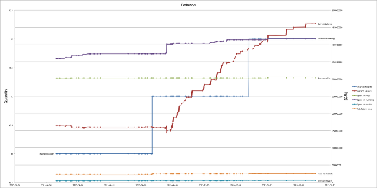

Elite: Dangerous Market Connector (EDMC)
========

This app downloads commodity market and other data from the game [Elite: Dangerous](https://www.elitedangerous.com/) and, at your choice, either:

* sends the data to the [Elite Dangerous Data Network](http://eddn-gateway.elite-markets.net/) ("EDDN") from where you and others can use it via online trading tools such as [eddb](http://eddb.io/), [Elite Trade Net](http://etn.io/), [Inara](http://inara.cz), etc.
* saves the data to files on your computer that you can load into trading tools such as [Slopey's BPC Market Tool](https://forums.frontier.co.uk/showthread.php?t=76081), [Trade Dangerous](https://bitbucket.org/kfsone/tradedangerous/wiki/Home), [Thrudd's Trading Tools](http://www.elitetradingtool.co.uk/), [Inara](http://inara.cz), etc.
* saves a record of your ship loadout, flight log and/or statistics.

The user-interface is deliberately minimal - when you land at a station just switch to the app and press the "Update" button or press Enter to automatically download and transmit and/or save your choice of data.

 

Installation
--------

Mac:

* Requires Mac OS 10.9 or later.
* Download the `.zip` archive of the [latest release](https://github.com/Marginal/EDMarketConnector/releases/latest).
* The zip archive contains the **EDMarketConnector** app - move this app to **Applications** or wherever you want it.
* Double-click on the app to run it.

Windows:

* Requires Windows 7 or later.
* Download the `.msi` package of the [latest release](https://github.com/Marginal/EDMarketConnector/releases/latest).
* Double-click on it to install.
* Run **Elite Dangerous Market Connector** from the Start Menu or Start Screen.

Setup
--------
The first time that you run the app you are prompted for your username and password. This is the same username and password
combination that you use to log into the Elite: Dangerous launcher, and is required so that the Frontier servers can send the app *your* data and the market data for the station that *you* are docked at.

You can also choose here what data to save (refer to the next section for details) and whether to attach your Cmdr name or a [pseudo-anonymized](http://en.wikipedia.org/wiki/Pseudonymity) ID to the data.

You are next prompted to authenticate with a "verification code", which you will shortly receive by email from Frontier.
Note that each "verification code" is one-time only - if you enter the code incorrectly or quit the app before
authenticating you will need to wait for Frontier to send you a new code.

If you are not prompted to authenticate, but instead see the message "Error: Invalid Credentials" then choose the menu
option EDMarketConnector → Preferences (Mac) or File → Settings (Windows) and double-check your username and password.

Output
--------
This app can save a variety of data in a variety of formats:

* Market data
  * Elite Dangerous Data Network - sends commodity market and shipyard data to "[EDDN](http://eddn-gateway.elite-markets.net/)" from where you and others can use it via online trading tools such as [eddb](http://eddb.io/), [Elite Trade Net](http://etn.io/), [Inara](http://inara.cz), etc.
  * Slopey's BPC format - saves commodity market data as files that you can load into [Slopey's BPC Market Tool](https://forums.frontier.co.uk/showthread.php?t=76081).
  * Trade Dangerous format - saves commodity market data as files that you can load into [Trade Dangerous](https://bitbucket.org/kfsone/tradedangerous/wiki/Home).
  * CSV format - saves commodity market data as files that you can upload to [Thrudd's Trading Tools](http://www.elitetradingtool.co.uk/) or [Inara](http://inara.cz).

* Ship loadout
  * After every outfitting change saves a record of your ship loadout as a file that you can open in a text editor and that you can import into [E:D Shipyard](http://www.edshipyard.com).

* Flight log
  * Adds a record of your location, ship and cargo to a file that you can open in a text editor or a spreadsheet program such as Excel. Note: Don't edit, rename or move this file - take a copy if you wish to change it.

* Cmdr statstics
  * Generates a number of charts of your progress in an Excel file. Note: Don't edit, rename or move this file.

By default these files will be placed in your Documents folder. Since this app will create a lot of files if you use it for a while you may wish to create a separate folder for the files and tell the app to place them there.

Statistics
--------
Choose the "Statistics" item from the menu to view your Cmdrs's statistics. The statistics shown are largely the same
as those available from the right-hand panel in-game, plus a few additions.

Uninstall
--------

Mac:

* Delete the **EDMarketConnector** app.

Windows:

* Uninstall **Elite Dangerous Market Connector** from Control Panel → Programs.

Note: Uninstalling the app does not delete any output files that it has previously written.

Running from source
--------

Download and extract the source code of the [latest release](https://github.com/Marginal/EDMarketConnector/releases/latest).

Mac:

* Requires the Python "requests" module - install this with `easy_install requests` .
* Run with `./EDMarketConnector.py` .

Windows:

* Requires Python2.7 and the Python "requests" module.
* Run with `EDMarketConnector.py` .

Linux:

* Requires the Python "imaging-tk", "iniparse" and "requests" modules. On Debian-based systems install these with `sudo apt-get install python-imaging-tk python-iniparse python-requests` .
* Run with `./EDMarketConnector.py` .

On all platforms charting Cmdr statistics additionally requires verison 2.3.0 or later of the [openpyxl](https://pypi.python.org/pypi/openpyxl) module.

Packaging for distribution
--------

Mac:

* requires py2app 0.9.x
* [Sparkle.framework](https://github.com/sparkle-project/Sparkle) installed in /Library/Frameworks
* Run `setup.py py2app`

Windows:

* requires py2exe 0.6.x
* winsparkle.dll & .pdb from [WinSparkle](https://github.com/vslavik/winsparkle) copied to the current directory
* [WiX Toolset](http://wixtoolset.org/)
* Run `setup.py py2exe`

Acknowledgements
--------
* "Elite: Dangerous" is © 1984 - 2014 Frontier Developments plc.
* Thanks to [James Muscat](https://github.com/jamesremuscat) for [EDDN](https://github.com/jamesremuscat/EDDN) and to [AnthorNet](https://github.com/AnthorNet) for the [stats](http://eddn-gateway.elite-markets.net/).
* Thanks to [Andargor](https://github.com/Andargor) for the idea of using the "Companion" interface in [edce-client](https://github.com/Andargor/edce-client).
* Uses [Sparkle](https://github.com/sparkle-project/Sparkle) by [Andy Matuschak](http://andymatuschak.org/) and the [Sparkle Project](https://github.com/sparkle-project).
* Uses [WinSparkle](https://github.com/vslavik/winsparkle/wiki) by [Václav Slavík](https://github.com/vslavik).

License
-------
Copyright © 2015 Jonathan Harris.

Licensed under the [GNU Public License (GPL)](http://www.gnu.org/licenses/gpl-2.0.html) version 2 or later.
