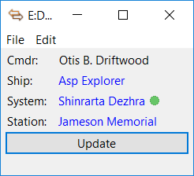
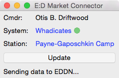
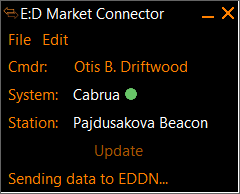
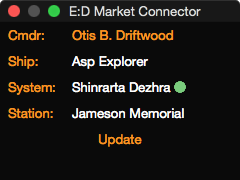
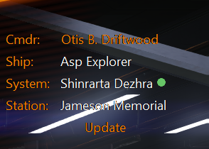

[](https://discord.gg/usQ5e6n)

Elite: Dangerous Market Connector (EDMC)
========

This app downloads your Cmdr's details and system, faction, scan and station data from the game [Elite: Dangerous](https://www.elitedangerous.com/) and, at your choice, either:

* sends station commodity market prices, other station data, system and faction information and body scan data to the [Elite Dangerous Data Network](https://github.com/EDSM-NET/EDDN/wiki) (“EDDN”) from where you and others can use it via online trading, prospecting and shopping tools such as [eddb](https://eddb.io/), [EDSM](https://www.edsm.net/), [Elite Trade Net](http://etn.io/), [Inara](https://inara.cz), [Roguey's](https://roguey.co.uk/elite-dangerous/), [Trade Dangerous](https://github.com/eyeonus/Trade-Dangerous/wiki), etc.
* sends your Cmdr's details, ship details, cargo, materials and flight log to [Elite Dangerous Star Map](https://www.edsm.net/) (“EDSM”).
* sends your Cmdr's details, ship details, cargo, materials, missions, community goal progress, and flight log to [Inara](https://inara.cz).
* saves station commodity market prices to files on your computer that you can load into trading tools such as [Trade Dangerous](https://github.com/eyeonus/Trade-Dangerous/wiki) or [mEDI's Elite Tools](https://github.com/mEDI-S/mEDI_s-Elite-Tools).
* saves a record of your ship loadout to files on your computer that you can load into outfitting tools such as [E:D&nbsp;Shipyard](http://www.edshipyard.com), [Coriolis](https://coriolis.edcd.io) or [Elite Trade Net](http://etn.io/).

You can run the app on the same PC or Mac on which you're running Elite: Dangerous or on another PC connected via a network share. PS4 and Xbox are not supported, sorry.

Usage
--------
The user-interface is deliberately minimal - your choice of data is automatically downloaded, transmitted and/or saved when you start Elite: Dangerous, land at a station, jump to a system or scan a body. Start the app before entering the game to ensure that you don't miss any data - some data is only available at game start.

Click on the ship name to view its loadout on [E:D&nbsp;Shipyard](http://www.edshipyard.com) (“EDSY”) or [Coriolis](https://coriolis.edcd.io) in your web browser.

Click on the system name to view its entry in [Elite: Dangerous Database](https://eddb.io/) (“eddb”), [Elite Dangerous Star Map](https://www.edsm.net/) (“EDSM”) or [Inara](https://inara.cz) in your web browser.

Click on the station name to view its entry in [eddb](https://eddb.io/), [EDSM](https://www.edsm.net/) or [Inara](https://inara.cz) in your web browser.

 &nbsp; 

 &nbsp; 



Installation
--------

Mac:

* Requires Mac OS 10.10 or later.
* Download the `.zip` archive of the [latest release](https://github.com/Marginal/EDMarketConnector/releases/latest).
* The zip archive contains the **EDMarketConnector** app - move this app to **Applications** or wherever you want it.
* Double-click on the app to run it.

Windows:

* Requires Windows 7 or later.
* Download the `.msi` package of the [latest release](https://github.com/Marginal/EDMarketConnector/releases/latest).
* Double-click on it to install.
* Run **Elite Dangerous Market Connector** from the Start Menu or Start Screen.


Setup
--------
The first time that you run the app while playing the game you are redirected to Frontier's authentication website and prompted for your username and password. This is the same username and password combination that you use to log into the Elite: Dangerous launcher.

This step is required so that the Frontier servers can send the app *your* data and the data for the station that *you* are docked at. Refer to the [Privacy Policy](PRIVACY.md) for how this app handles your data.

### Output

This app can save a variety of data in a variety of formats:

* Market data
  * Trade Dangerous format file - saves commodity market data as files that you can load into [Trade Dangerous](https://github.com/eyeonus/Trade-Dangerous/wiki).
  * CSV format file - saves commodity market data as files that you can upload to [mEDI's Elite Tools](https://github.com/mEDI-S/mEDI_s-Elite-Tools).

  Note that the above tools can be configured to consume data from the “[EDDN](https://github.com/EDSM-NET/EDDN/wiki)” data feed (see below). You may find using the EDDN feed easier and more productive than using these data files.

* Ship loadout
  * After every outfitting change saves a record of your ship loadout as a file that you can open in a text editor and that you can import into [E:D&nbsp;Shipyard](http://www.edshipyard.com), [Coriolis](https://coriolis.edcd.io) or [Elite Trade Net](http://etn.io/).

By default these files will be placed in your Documents folder. Since this app will create a lot of files if you use it for a while you may wish to create a separate folder for the files and tell the app to place them there.

Some options work by reading the Elite: Dangerous game's log files. If you're running this app on a different machine from the Elite: Dangerous game then adjust the “E:D journal file location” setting on the Configuration tab to point to the game's log files.

### EDDN

* Station data
  * Sends station commodity market, outfitting and shipyard data to “[EDDN](https://github.com/EDSM-NET/EDDN/wiki)” from where you and others can use it via trading tools such as [eddb](http://eddbs.io/), [EDSM](https://www.edsm.net/), [Elite Trade Net](http://etn.io/), [Inara](https://inara.cz), [mEDI's Elite Tools](https://github.com/mEDI-S/mEDI_s-Elite-Tools), [Roguey's](https://roguey.co.uk/elite-dangerous/), [Trade Dangerous](https://github.com/eyeonus/Trade-Dangerous/wiki) with the [EDDBlink](https://github.com/eyeonus/Trade-Dangerous/wiki/Plugin-Options#eddblink) plugin, etc.
* System and scan data
  * Sends system and faction information and the results of your planet scans to “[EDDN](https://github.com/EDSM-NET/EDDN/wiki)” from where you and others can use it via online prospecting tools such as [eddb](https://eddb.io/), [EDSM](https://www.edsm.net/), [Inara](https://inara.cz), etc.
  * You can choose to delay sending this information to EDDN until you're next safely docked at a station. Otherwise the information is sent as soon as you enter a system or perform a scan.

### EDSM

You can send a record of your Cmdr's details, ship details, cargo, materials, missions and flight log to [Elite Dangerous Star Map](https://www.edsm.net/). You will need to register for an account and then follow the “[Elite Dangerous Star Map credentials](https://www.edsm.net/settings/api)” link to obtain your API key.

### Inara

You can send a record of your Cmdr's details, ship details, cargo, materials, missions, community goal progress, and flight log to [Inara](https://inara.cz/). You will need to register for an account and then follow the “[Inara credentials](https://inara.cz/settings-api/)” link to obtain your API key. Your flight log on Inara is updated in real-time. Other information is updated on startup and then less frequently - typically on leaving a station.


Uninstall
--------

Mac:

* Delete the **EDMarketConnector** app.

Windows:

* Uninstall **Elite Dangerous Market Connector** from Control Panel → Programs.

Note: Uninstalling the app does not delete any output files that it has previously written.


Plugins
--------
Plugins extend the behaviour of this app. To install a downloaded plugin:

* On the Plugins settings tab press the “Open” button. This reveals the `plugins` folder where this app looks for plugins.
* Open the `.zip` archive that you downloaded and move the folder contained inside into the `plugins` folder.

You will need to re-start EDMC for it to notice the new plugin.

The `plugins` folder is located at:

* Windows: `%LOCALAPPDATA%\EDMarketConnector\plugins` (usually `C:\Users\you\AppData\Local\EDMarketConnector\plugins`).
* Mac: `~/Library/Application Support/EDMarketConnector/plugins` (in Finder hold ⌥ and choose Go &rarr; Library to open your `~/Library` folder).
* Linux: `$XDG_DATA_HOME/EDMarketConnector/plugins`, or `~/.local/share/EDMarketConnector/plugins` if `$XDG_DATA_HOME` is unset.

Refer to [PLUGINS.md](PLUGINS.md) if you would like to write a plugin.


Troubleshooting
--------

### App repeatedly opens the Frontier authentication website
The authentication didn't complete correctly for some reason. This can be caused by:

- Using Internet Explorer. IE is [known](https://blogs.msdn.microsoft.com/ieinternals/2011/07/13/understanding-protocols/) to be broken. Please (temporarily) set your default browser to Edge, Chrome or Firefox and retry.
- The Frontier authentication website is confused - see [Error: An error occured](#error-an-error-occured).
- Entering credentials for a different Cmdr - see [Error: Wrong Cmdr](#error-wrong-cmdr).
- Entering Steam credentials instead of Frontier credentials - see [Error: User not found](#error-user-not-found).

### Error: Invalid Credentials
See [above](#app-repeatedly-opens-the-frontier-authentication-website).

### Error: An error occured
The Frontier authentication website is confused. Visit the [Frontier authentication website](https://auth.frontierstore.net/), log in and deauthorize "Elite Dangerous Market Connector". Then restart the app.

### 500 internal server error
Either:

- You pressed the "Approve" button on Frontier's authentication website twice. This is harmless; if the app isn't displaying any error messages and isn't redirecting again to Frontier's authentication website then all is fine.
- Frontier's authentication website sometimes gets overloaded and displays this error. Please try again later.

### Error: User not found
Your Steam account may not be linked to your Frontier account (you can check whether you have any external accounts linked on the [Frontier store](https://www.frontierstore.net/frontier_partnerkeys/)).

Please enter your Frontier credentials into the authentication website, not your Steam credentials.

### Doesn't auto-update and/or persistently gives “Server is lagging” error
This app uses Elite: Dangerous' log files to track the systems and stations that you visit. If you're running this app on a different machine from the Elite: Dangerous game, or if you find that this app isn't automatically tracking the systems that you visit and/or isn't automatically “updating” on docking (if you have that option selected), then adjust the “E:D journal file location” setting on the Configuration tab to point to the game's log files.

The default location on Windows is typically `C:\Users\you\Saved Games\Frontier Developments\EliteDangerous`.

### Credentials settings are greyed out
You won't be redirected to Frontier's authentication website and can't edit your EDSM or Inara credentials if:
- Elite: Dangerous is at the Main Menu. You will be able to edit these values once you've entered the game.
- The last time you ran Elite: Dangerous you didn't enter the game. You will be able to edit these values once you've entered the game.
- Your “E:D journal file location” setting is incorrect. See [above](#doesnt-auto-update-andor-persistently-gives-server-is-lagging-error).

### Error: Wrong Cmdr
The Frontier server that supplies data to this app is supplying data for a different Cmdr than the one that you're currently playing. You are redirected to Frontier's authentication website and prompted again for your username and password. Either:

1. You have multiple accounts and the username/password setting is not for the account that you're currently playing; or
2. You have reset your Cmdr but Frontier's server is still supplying data for the old Cmdr.

If 1 check your username/password settings.

If 2 this problem may or may not resolve itself in time.

### I run two instances of E:D simultaneously, but I can't run two instances of EDMC
EDMC supports this scenario if you run the second instance of E:D in a *different* user account - e.g. using `runas` on Windows. Run the second instance of EDMC in the same user account as the second instance of E:D.

EDMC doesn't support running two instances of E:D in the *same* user account. EDMC will only respond to the instance of E:D that you ran last.

### I forgot to run the app - is there a way to process the missing data?
EDMC only processes live data from E:D. But you can upload your [journal](#doesnt-auto-update-andor-persistently-gives-server-is-lagging-error) file(s) for the missing period to [EDSM](https://www.edsm.net/en/settings/import/journal) and [Inara](https://inara.cz/settings/).

### Error: Can't connect to EDDN
EDMC needs to talk to eddn.edcd.io on port 4430. If you consistently receive this error check that your router or VPN configuration allows port 4430 / tcp outbound. If using a proxy add `eddn.edcd.io` to the exemption list, plus `www.edsm.net` and/or `inara.cz` if using EDSM and/or Inara integration.

### Import failed: No ship loadout found
Complex ship loadouts with Engineers' mods can cause you to hit an Internet Explorer / Edge limitation on the length of URLs. Switch to a browser that doesn't suck.

### Very long "cooldown" period
You'll see a very long cooldown period if your system's time of day changes while you're running the app. To fix this:

- Quit the app.
- Double-check your system's Date and Time settings.
- Windows: Run the RegEdit program and locate and delete the key `HKEY_CURRENT_USER\Software\Marginal\EDMarketConnector\querytime`.
- Mac: Copy and paste the following into a Terminal app window: `defaults write uk.org.marginal.edmarketconnector querytime -int 0` and press Enter.
- Re-start the app.

### Update Error!
The [GitHub server](https://github.com/Marginal/EDMarketConnector/releases/latest) that hosts this app's updates only supports TLS 1.2 and higher. Follow [these](https://help.passageways.com/hc/en-us/articles/115005183226-How-to-enable-TLS-1-2-in-Internet-Explorer-11-and-MS-Edge) instructions to change your Windows settings to disable the [deprecated](https://tools.ietf.org/html/rfc7568) SSL 2.0 and 3.0 protocols and enable TLS 1.2.

### Location of configuration files
If your configuration has been corrupted, or badly set, such that you can't run the program to fix it, or you otherwise need to directly access the configuration then these are the locations of the configuration:

* Mac: You can use the 'defaults' command to interact with the stored settings, i.e.

  `defaults read uk.org.marginal.edmarketconnector`

  to show the current settings and appropriate '[write](https://developer.apple.com/legacy/library/documentation/Darwin/Reference/ManPages/man1/defaults.1.html)' commands to change them.
* Windows: Configuration is stored in the registry under `HKEY_CURRENT_USER\Software\Marginal\EDMarketConnector` . There are also some non-configuration files at `%LOCALAPPDATA%\EDMarketConnector\` in your user profile.
* Linux: Configuration is stored in the file `${HOME}/.config/EDMarketConnector/EDMarketConnector.ini`

### Installing on a different drive
* In Control Panel uninstall "Elite Dangerous Market Connector".
* At a Command Prompt type:

  `msiexec /i "X:\path\to\EDMarketConnector_win_NNN.msi" INSTALLDIR="Y:\destination\EDMarketConnector"`

Future updates will also be installed to this location.

### PS4 and Xbox support

This app doesn't work with PS4 or Xbox Elite: Dangerous accounts. On these platforms the game lacks support for the API and Journal files that this app relies on.

### Reporting a problem
Please report a problem as a new GitHub [issue](https://github.com/Marginal/EDMarketConnector/issues/new). Please wait for the error to occur and zip up and attach this app's log file to the new issue:

Mac:

* `$TMPDIR/EDMarketConnector.log`

Windows:

* `%TMP%\EDMarketConnector.log`


Running from source
--------

Download and extract the [latest source code](https://github.com/Marginal/EDMarketConnector/archive/master.zip) (or fork and clone if you're comfortable with using `git`).

Mac:

* Requires the Python “requests” and “watchdog” modules, plus an up-to-date “py2app” module if you also want to package the app - install these with `easy_install -U requests watchdog py2app` .
* Run with `python ./EDMarketConnector.py` .

Windows:

* Requires Python2.7 and the Python “requests” and “watchdog” modules, plus “py2exe” 0.6 if you also want to package the app.
* Run with `EDMarketConnector.py` .

Linux:

* Requires Python2.7 and the Python “iniparse”, “requests” and "tkinter" modules. On Debian-based systems install these with `sudo apt-get install python-iniparse python-requests python-tk` .
* Run with `./EDMarketConnector.py` .

Command-line
--------

The command-line program `EDMC.py` writes the current system and station (if docked) to stdout and optionally writes player status, ship locations, ship loadout and/or station data to file.
This program requires that the user has performed [setup](#setup) and verification through the app.

Arguments:

```
 -h, --help     show this help message and exit
 -v, --version  print program version and exit
 -a FILE        write ship loadout to FILE in Companion API json format
 -e FILE        write ship loadout to FILE in E:D Shipyard plain text format
 -l FILE        write ship locations to FILE in CSV format
 -m FILE        write station commodity market data to FILE in CSV format
 -o FILE        write station outfitting data to FILE in CSV format
 -s FILE        write station shipyard data to FILE in CSV format
 -t FILE        write player status to FILE in CSV format
 -d FILE        write raw JSON data to FILE
 -n             send data to EDDN
 -p CMDR        Returns data from the specified player account
```

The program returns one of the following exit codes. Further information may be written to stderr.
<ol start="0">
  <li>Success. Note that this doesn't necessarily mean that any requested output files have been produced - for example if the current station doesn't support the facilities for which data was requested.</li>
  <li>Server is down.</li>
  <li>Invalid Credentials.</li>
  <li>Verification Required.</li>
  <li>Server is lagging.</li>
  <li>I/O or other OS error.</li>
</ol>


Packaging for distribution
--------

Mac:

* requires py2app 0.9.x
* [Sparkle.framework](https://github.com/sparkle-project/Sparkle) installed in /Library/Frameworks
* Run `setup.py py2app`

Windows:

* requires py2exe 0.6.x
* winsparkle.dll & .pdb from [WinSparkle](https://github.com/vslavik/winsparkle) copied to the current directory
* [WiX Toolset](http://wixtoolset.org/)
* Run `setup.py py2exe`


Disclaimer
--------
This app uses the “Companion” web API that Frontier originally supplied for their Elite Dangerous iOS app and now [support](https://forums.frontier.co.uk/showthread.php?t=218658&p=3371472#post3371472) for third-party apps. However this API could go away at some time in the future - in which case this app will cease to work.


Acknowledgements
--------
* “Elite: Dangerous” is © 1984 - 2018 Frontier Developments plc.
* Thanks to Cmdr Zhixian Wu for the Chinese (Simplified) translation.
* Thanks to Cmdrs CatfoodCZ, Mike Stix & DaraCZ for the Czech translation.
* Thanks to Cmdr CoolBreeze for the Dutch translation.
* Thanks to Cmdr FreezeFIN for the Finnish translation.
* Thanks to [Cmdr Anthor](https://edsm.net/) for the French translation.
* Thanks to Cmdr DragoCubX for keeping the German translation up to date.
* Thanks to Cmdr Wormhole for the Hungarian translation.
* Thanks to [Cmdr Koreldan](http://ed-map.eu/) for the Italian translation.
* Thanks to Cmdr magni1200s for the Japanese translation.
* Thanks to Cmdr bubis7 for the Latvian translation.
* Thanks to Cmdr Amarok 73 for the Polish translation.
* Thanks to Cmdrs Pivatto (@rafaelpivatto), Moraes (@wesleymoura), Wladimir JRC, and Warlord from Cobra Wing for the Portuguese (Brazil) translation.
* Thanks to Carlos Oliveira (@idontcare1996) for the Portuguese (Portugal) translation.
* Thanks to Shadow Panther for keeping the Russian translation up to date.
* Thanks to Cmdr SuperBrain for the Serbian translation.
* Thanks to Armando Ota for the Slovenian translation.
* Thanks to Cmdr Mila Strelok for the Spanish translation.
* Thanks to Taras Velychko for the Ukranian translation.
* Thanks to [Ian Norton](https://github.com/inorton) for plugin support.
* Thanks to [Cmdr Anthor](https://github.com/EDSM-NET) and [James Muscat](https://github.com/jamesremuscat) for [EDDN](https://github.com/EDSM-NET/EDDN/wiki).
* Thanks to [Andargor](https://github.com/Andargor) for the idea of using the “Companion” interface in [edce-client](https://github.com/Andargor/edce-client).
* Uses [Python Keyring Lib](https://github.com/jaraco/keyring) by Jason R. Coombs, Kang Zhang, et al.
* Uses [Sparkle](https://github.com/sparkle-project/Sparkle) by [Andy Matuschak](http://andymatuschak.org/) and the [Sparkle Project](https://github.com/sparkle-project).
* Uses [WinSparkle](https://github.com/vslavik/winsparkle/wiki) by [Václav Slavík](https://github.com/vslavik).
* Uses [OneSky](http://www.oneskyapp.com/) for [translation management](https://marginal.oneskyapp.com/collaboration/project?id=52710).
* Uses "Euro Caps" font by [Tom Oetken](https://www.dafont.com/profile.php?user=298681).

License
-------
Copyright © 2015-2018 Jonathan Harris.

Licensed under the [GNU Public License (GPL)](http://www.gnu.org/licenses/gpl-2.0.html) version 2 or later.
